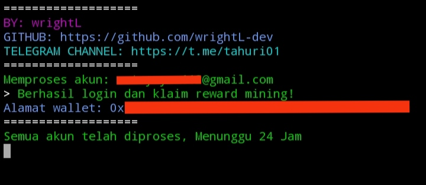

# BOT FUNCTOR NODE



**Fitur:**

**• Multi Akun**

**• Multi Thread**

**• Auto Claim Tiap 24 Jam**

**• Spam Random Epoch 1-3 Menit Agar Node Aktif**


*Note: Hanya Bisa Login Lewat Email*

# Cara Jalankan:

1. **Clone Repository**
   ```bash
   git clone https://github.com/wrightL-dev/FUNCTOR-NODE
   cd FUNCTOR-NODE

2. **Install Package**
   ```bash
   npm install axios readline random-useragent

3. **Edit File akun.txt Terlebih Dahulu Masukan Email Dan Password Sesuai Format, Dan Multi Akun Tinggal Tambahin List Di Bawah Nya**

4. **node functor.js**

## Dukungan

Jika Anda memiliki pertanyaan atau butuh bantuan lebih lanjut, silakan bergabung dengan saluran Telegram kami di [t.me/tahuri01](https://t.me/tahuri01).

## Lisensi

Proyek ini dilisensikan di bawah [MIT License](LICENSE).
